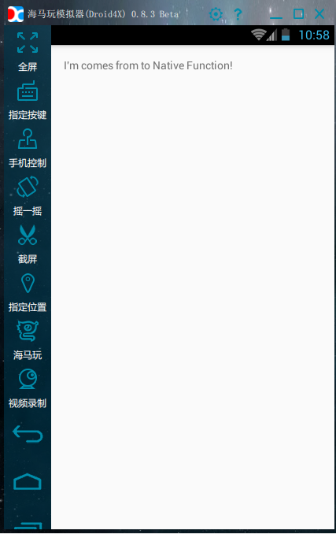

### 转载自:[<http://blog.csdn.net/rznice/article/details/42295215>](<http://blog.csdn.net/rznice/article/details/42295215>)
# NDKtest
#### Platform : Android Studio 1.4 preview2
#### Gradle Version : 2.5
#### Gradle Plugin Version : 1.3.1
#### Version : 1.0
#### [](https://www.apache.org/licenses/LICENSE-2.0)

#### Project website:[https://github.com/kebe0325/NDKtest.git](https://github.com/kebe0325/NDKtest.git)

## 简介

<p>&nbsp;&nbsp;&nbsp;&nbsp;&nbsp;&nbsp;&nbsp;Android的NDK开发入门指南.首先说为什么写Android项目要用到NDK开发，这里简单介绍一下其中有点：使用Android NDK主要就是为了提升应用的性能,对于那些对性能要求比较高的app 而言可以使用Android NDK,同时NDK绕过了Android的虚拟机的限制,可以使用一些更加底层的方法或是权限,但是使用Android NDK无论设计的多好,都会增加app的复杂性。</p>
<p>&nbsp;&nbsp;&nbsp;&nbsp;&nbsp;&nbsp;&nbsp;但是这里我们只是单纯的说一下怎么通过Android进行NDK编程，而不去探讨更深层次的内容，创建一个Android NDK项目一般遵循一下步骤：</p>

<ol>
<li>创建一个空项目;</li>
<li>在配置<code>NDK</code>路径;</li>
<li>在入口<code>Activity</code>中定义一个<code>native</code>方法;</li>
<li>利用<code>javah</code>生成<code>c</code>的头文件;</li>
<li>在<code>jni</code>目录下新建一个<code>c</code>文件;</li>
<li>引用<code>so</code>文件（没看到<code>so</code>文件）;</li>
<li>加载<code>so</code>文件;</li>
<li>配置布局文件和入口文件。</li>
</ol>

## 功能实现
* 创建一个空的<code>project</code>；
* 在<code>local.properties</code>中配置<code>NDK</code>路径：
<pre><code>ndk.dir=D\:\\ComSoftwares\\android-ndk
  sdk.dir=D\:\\ComSoftwares\\android-sdk</code></pre>
  
* 在入口<code>Activity</code>中定义一个<code>native</code>方法:
<pre><code>public native String getStringFromNative();</code></pre>

* 利用<code>javah</code>生成<code>c</code>文件：
<p>&nbsp;&nbsp;&nbsp;&nbsp;&nbsp;&nbsp;&nbsp;根据项目路径和编译环境写出下面功能命令行，</p>
<pre><code>javah -d jni -classpath D:\ComSoftwares\android-sdk\platforms\android-22\android.jar;..\..\build\intermediates\classes\debug com.ndktest.MainActivity</code></pre>
<p>&nbsp;&nbsp;&nbsp;&nbsp;&nbsp;&nbsp;&nbsp;在Android Studio中的Terminal控制台中先用<code>cd ../../</code>返回到前两级文件夹，粘贴上面的长串代码，回车执行。会在<code>jni</code>中生成相应的头文件:<code>com_ndktest_MainActivity.h</code>.</p>
<p>&nbsp;&nbsp;&nbsp;&nbsp;&nbsp;&nbsp;&nbsp;打开<code>com_ndktest_MainActivity.h</code>可以看到：</p>

```c
/* DO NOT EDIT THIS FILE - it is machine generated */
#include <jni.h>
/* Header for class com_ndktest_MainActivity */

#ifndef _Included_com_ndktest_MainActivity
#define _Included_com_ndktest_MainActivity
#ifdef __cplusplus
extern "C" {
#endif
#undef com_ndktest_MainActivity_BIND_ABOVE_CLIENT
#define com_ndktest_MainActivity_BIND_ABOVE_CLIENT 8L
#undef com_ndktest_MainActivity_BIND_ADJUST_WITH_ACTIVITY
#define com_ndktest_MainActivity_BIND_ADJUST_WITH_ACTIVITY 128L
#undef com_ndktest_MainActivity_BIND_ALLOW_OOM_MANAGEMENT
#define com_ndktest_MainActivity_BIND_ALLOW_OOM_MANAGEMENT 16L
#undef com_ndktest_MainActivity_BIND_AUTO_CREATE
#define com_ndktest_MainActivity_BIND_AUTO_CREATE 1L
#undef com_ndktest_MainActivity_BIND_DEBUG_UNBIND
#define com_ndktest_MainActivity_BIND_DEBUG_UNBIND 2L
#undef com_ndktest_MainActivity_BIND_IMPORTANT
#define com_ndktest_MainActivity_BIND_IMPORTANT 64L
#undef com_ndktest_MainActivity_BIND_NOT_FOREGROUND
#define com_ndktest_MainActivity_BIND_NOT_FOREGROUND 4L
#undef com_ndktest_MainActivity_BIND_WAIVE_PRIORITY
#define com_ndktest_MainActivity_BIND_WAIVE_PRIORITY 32L
#undef com_ndktest_MainActivity_CONTEXT_IGNORE_SECURITY
#define com_ndktest_MainActivity_CONTEXT_IGNORE_SECURITY 2L
#undef com_ndktest_MainActivity_CONTEXT_INCLUDE_CODE
#define com_ndktest_MainActivity_CONTEXT_INCLUDE_CODE 1L
#undef com_ndktest_MainActivity_CONTEXT_RESTRICTED
#define com_ndktest_MainActivity_CONTEXT_RESTRICTED 4L
#undef com_ndktest_MainActivity_MODE_APPEND
#define com_ndktest_MainActivity_MODE_APPEND 32768L
#undef com_ndktest_MainActivity_MODE_ENABLE_WRITE_AHEAD_LOGGING
#define com_ndktest_MainActivity_MODE_ENABLE_WRITE_AHEAD_LOGGING 8L
#undef com_ndktest_MainActivity_MODE_MULTI_PROCESS
#define com_ndktest_MainActivity_MODE_MULTI_PROCESS 4L
#undef com_ndktest_MainActivity_MODE_PRIVATE
#define com_ndktest_MainActivity_MODE_PRIVATE 0L
#undef com_ndktest_MainActivity_MODE_WORLD_READABLE
#define com_ndktest_MainActivity_MODE_WORLD_READABLE 1L
#undef com_ndktest_MainActivity_MODE_WORLD_WRITEABLE
#define com_ndktest_MainActivity_MODE_WORLD_WRITEABLE 2L
#undef com_ndktest_MainActivity_DEFAULT_KEYS_DIALER
#define com_ndktest_MainActivity_DEFAULT_KEYS_DIALER 1L
#undef com_ndktest_MainActivity_DEFAULT_KEYS_DISABLE
#define com_ndktest_MainActivity_DEFAULT_KEYS_DISABLE 0L
#undef com_ndktest_MainActivity_DEFAULT_KEYS_SEARCH_GLOBAL
#define com_ndktest_MainActivity_DEFAULT_KEYS_SEARCH_GLOBAL 4L
#undef com_ndktest_MainActivity_DEFAULT_KEYS_SEARCH_LOCAL
#define com_ndktest_MainActivity_DEFAULT_KEYS_SEARCH_LOCAL 3L
#undef com_ndktest_MainActivity_DEFAULT_KEYS_SHORTCUT
#define com_ndktest_MainActivity_DEFAULT_KEYS_SHORTCUT 2L
#undef com_ndktest_MainActivity_RESULT_CANCELED
#define com_ndktest_MainActivity_RESULT_CANCELED 0L
#undef com_ndktest_MainActivity_RESULT_FIRST_USER
#define com_ndktest_MainActivity_RESULT_FIRST_USER 1L
#undef com_ndktest_MainActivity_RESULT_OK
#define com_ndktest_MainActivity_RESULT_OK -1L
/*
 * Class:     com_ndktest_MainActivity
 * Method:    getStringFromNative
 * Signature: ()Ljava/lang/String;
 */
JNIEXPORT jstring JNICALL Java_com_ndktest_MainActivity_getStringFromNative
  (JNIEnv *, jobject);

#ifdef __cplusplus
}
#endif
#endif
```
* 在<code>jni</code>中新建一个<code>c</code>文件，将名字命名为：<code>main.c</code>,输入以下内容:

```c
//
// Created by Administrator on 2015/8/18.
//

#include "com_ndktest_MainActivity.h"
/*
 * Class:     com_ndktest_MainActivity
 * Method:    getStringFromNative
 * Signature: ()Ljava/lang/String;
 */
JNIEXPORT jstring JNICALL Java_com_ndktest_MainActivity_getStringFromNative
        (JNIEnv * env, jobject obj){
    return (*env)->NewStringUTF(env,"I'm comes from to Native Function!");
}
```
<p>&nbsp;&nbsp;&nbsp;&nbsp;&nbsp;&nbsp;&nbsp;如果编译出错，请在jni文件夹中新建一个空的<code>.c</code>文件，比如<code>utils.c</code>。在此我没有碰到错误，所以没有添加空文件</p>

* 在app目录下的<code>build.gradle</code>中设置库文件名（生成的<code>so</code>文件名--但是我在项目中并未看到有<code>so</code>文件生成）;
<p>&nbsp;&nbsp;&nbsp;&nbsp;&nbsp;&nbsp;&nbsp;找到<code>defaultConfig</code>项，添加以下内容：</p>
<pre><code>ndk{  
        moduleName "MyJni"  //设置库(so)文件名称  
} </code></pre>

* 加载<code>so</code>文件:
<pre><code>static {  
    System.loadLibrary("MyJni");  
}</code></pre>

* 配置布局文件和入口文件
<p>&nbsp;&nbsp;&nbsp;&nbsp;&nbsp;&nbsp;&nbsp;在此贴出布局的完整代码：</p>

```
<RelativeLayout xmlns:android="http://schemas.android.com/apk/res/android"
                xmlns:tools="http://schemas.android.com/tools"
                android:layout_width="match_parent"
                android:layout_height="match_parent"
                android:paddingLeft="@dimen/activity_horizontal_margin"
                android:paddingRight="@dimen/activity_horizontal_margin"
                android:paddingTop="@dimen/activity_vertical_margin"
                android:paddingBottom="@dimen/activity_vertical_margin"
                tools:context=".MainActivity">

    <TextView
        android:text="@string/hello_world"
        android:layout_width="wrap_content"
        android:layout_height="wrap_content"
        android:id="@+id/myJni"/>

</RelativeLayout>
```
<p>&nbsp;&nbsp;&nbsp;&nbsp;&nbsp;&nbsp;&nbsp;MainActivity的完整代码:</p>

```
package com.ndktest;

import android.app.Activity;
import android.os.Bundle;
import android.view.Menu;
import android.view.MenuItem;
import android.widget.TextView;

public class MainActivity extends Activity {
    private TextView tv=null;
    @Override
    protected void onCreate(Bundle savedInstanceState) {
        super.onCreate(savedInstanceState);
        setContentView(R.layout.activity_main);

        tv=(TextView)findViewById(R.id.myJni);
        tv.setText(getStringFromNative());
    }

    @Override
    public boolean onCreateOptionsMenu(Menu menu) {
        // Inflate the menu; this adds items to the action bar if it is present.
        getMenuInflater().inflate(R.menu.menu_main, menu);
        return true;
    }

    @Override
    public boolean onOptionsItemSelected(MenuItem item) {
        // Handle action bar item clicks here. The action bar will
        // automatically handle clicks on the Home/Up button, so long
        // as you specify a parent activity in AndroidManifest.xml.
        int id = item.getItemId();

        //noinspection SimplifiableIfStatement
        if (id == R.id.action_settings) {
            return true;
        }

        return super.onOptionsItemSelected(item);
    }
    public native String getStringFromNative();

    static {
        System.loadLibrary("MyJni");
    }
}
```

## 运行结果

<p>&nbsp;&nbsp;&nbsp;&nbsp;&nbsp;&nbsp;&nbsp;编译运行可以看到从native方法传过来的值：</p>

